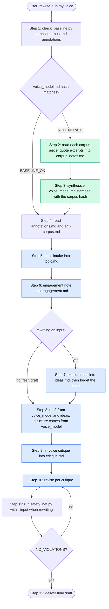

# How to create a Claude Skill that writes in my own voice

## The wrong way (and why it's tempting)

The intuitive approach: write a skill called `my-voice` that says things like _"My style is direct, technical, has a POV, uses backticks, dislikes corporate language."_ A list of adjectives and tendencies.

This is what most "writing style" prompts look like. It's also why most AI-written content sounds like AI written by a slightly different AI. Adjectives don't transfer voice. _"Be direct"_ produces 100 different outputs from 100 different LLMs, and none of them sound like me.

Voice isn't a set of properties — it's a set of _patterns_. The shape of my sentences. Where I put the verb. How long I let a thought run before a break. What I do with the second-most-important point. Whether I ever use a one-word paragraph. Whether I use em-dashes or parentheticals or both. These are checkable against actual writing, but they're nearly impossible to articulate from scratch. They operate below the level of conscious style.

A voice skill built from my description of my voice will be mediocre. A voice skill built from my _writing_ — actual samples — will be better. But samples alone are not enough either. They are necessary, not sufficient.

## Why "just put samples in a folder" doesn't work

The natural assumption: drop 8–15 samples in a `corpus/` folder, write a few rules in `SKILL.md`, point Claude at it, done. This is the structure most "voice" tools ship with. It produces drafts that sound _like a slightly different AI pretending to be me_, not like me.

The reason is mechanical. A skill is plain markdown injected into the model's context window. The corpus sits there as reference text. The model is _free_ to read it, but it's also free to skim — and pretraining bias toward "polished professional writing" is a much stronger force than 8–15 short samples in context. The model reads `SKILL.md`, intends to absorb the corpus, then defaults to its prior when drafting.

I can't fix this by writing more rules. Rules become a checklist the model applies typographically _(swap em-dash for en-dash, expand contractions, promote bold to ## headings)_ and reports back as "voice rewrite." It isn't.

The fix is structural: the skill must force the model to _inhabit I as a writer_ before drafting, by computing a structured model of my writing into context as an active step, then drafting from inside that model. The corpus is the source. The annotations and anti-corpus calibrate. The protocol is what makes the corpus actually win against the priors.

## Building an internal model of me-as-writer from the corpus

This is the load-bearing concept of the whole skill, so worth being precise about what it means.

### What "internal model" means here

There are two kinds of internal model. The first is _weight-level_ — the kind I'd get from fine-tuning. The corpus becomes part of the model's parameters and the probability distribution of next-token prediction shifts toward my voice. In principle this gives consistent voice across topics. In practice, at the data scale most individuals can produce (8–15 corpus pieces, maybe a hundred or two paired examples), fine-tuning a local 7B model produces drafts that are *worse* than what a well-built markdown skill produces — not better. The fine-tuning ceiling at small-data scale sits BELOW the markdown-skill ceiling, not above it. (Weight-level fine-tuning of Claude itself is also not exposed.)

The second is _context-level_ — the kind a markdown skill can produce. My corpus sits in the input context, and the model is free to read it and condition its output on it, but its weights are unchanged. Generation is still pulled hard toward pretraining priors *(i.e. polished professional writing)*. A good protocol can fight the pull, a bad one can't, but no protocol can eliminate it.

A markdown skill cannot build a true internal model. What it _can_ do is force the model to _simulate_ having one, every time, from scratch, by computing a structured analysis of my writing into context before drafting. That simulation is the writer-model. It's real and useful, and empirically — at the data scale most individuals can produce — it outperforms locally fine-tuned models of comparable accessibility. The ceiling for context-conditioned skills is around 85% voice match; the ceiling for a hobbyist-scale local fine-tune of a 7B model sits lower than that, not higher.

### Why writing it down works (and reading silently doesn't)

Reading the corpus is passive. The text enters context and sits there. The model's prior toward "polished writing" still wins because the corpus has not been engaged with — it has only been _seen_.

Writing a structured analysis of the corpus is active. The act of producing the analysis forces the model to actually examine paragraph rhythm, opening shape, transition vocabulary, what the writer reaches for and avoids, and to commit observations to a file. That commitment is what biases generation: the model can't draft without referencing the analysis it just produced, because the analysis exists as the most recent and most concrete reference for "what the writer does."

This is why the protocol's step 2 *(per-piece reading with quoted excerpts)* and step 3 *(synthesis of `voice_model.md`)* are non-negotiable. A model that skips them and drafts directly from the corpus produces typographic substitution every time. A model that does them produces something closer to inhabitation.

### The structure of `voice_model.md`

The writer-model needs nine sections, each with corpus citations. Each section answers a specific question that the corpus alone leaves implicit, and that pretraining priors will get wrong if not made explicit:

- **Opening moves** — what my first 1–2 sentences mechanically do, and what I avoid opening with. _(Closes the "balanced tripartite hook" failure mode.)_
- **Transition vocabulary** — specific connectors I reach for, specific ones I don't. _(Closes the "Furthermore / Moreover / Notably" Claude default.)_
- **Paragraph and sentence rhythm** — variance pattern, where one-line paragraphs land, how long paragraphs get. _(Closes the "uniform-block" drift.)_
- **What the writer reaches for** — concrete moves: parenthetical italics, light bold, em-dashes, story-shaped framing, etc. _(Gives the drafting step a positive target.)_
- **What the writer avoids** — patterns from annotations + anti-corpus + corpus observation. _(Gives the drafting step a negative target.)_
- **Handling uncertainty** — how I flag estimates, hedges, "I don't know." _(Closes the "stack-the-qualifiers" Claude default.)_
- **Handling praise** — how I give credit. _(Voice changes register here; needs an explicit pattern.)_
- **Handling criticism** — how I name a failure mode without piling on. _(Same.)_
- **Closings** — declarative observations, terminal claims, memorable phrases, or inline reference links — never meta-closers or generic invitations. _(Closes the "happy to discuss" failure mode.)_

Every claim in the model cites at least one corpus piece by filename. The citations are what make the model _falsifiable_ rather than asserted — if a claim has no citation, it's a guess, and guesses don't bias generation reliably.

The first line of `voice_model.md` stamps the corpus hash:

```
> Generated from corpus hash: c3eec658f11a4844e1f2965ef3e8d0571e163c83330abdc4ebee813406af11df
```

The hash is the cache key. `check_baseline.py` reads it on every invocation and decides whether to reuse the cached writer-model or rebuild from scratch.

### How the writer-model gets used during drafting

Step 7 of the protocol *(engagement note)* is the bridge that puts the writer-model into _active_ reasoning before the first sentence is written. The engagement note picks 5–7 specific moves from `voice_model.md` and commits to applying them in this draft, each tied to a section of the model.

Step 8 *(draft)* names `voice_model.md` and `engagement.md` as the primary references — _not_ the corpus, _not_ the annotations. The model drafts against the analysis it just produced, with the corpus available only for sampling specific phrasings. This ordering matters: drafting against the corpus directly biases toward imitation of specific pieces; drafting against the writer-model biases toward the underlying patterns.

Step 9 *(in-voice critique)* re-engages the writer-model from the other direction. The model writes a critique of its own draft _as the writer would_, citing `voice_model.md` and `anti-corpus.md` for each failure. Step 10 *(revise)* applies the critique. This loop is where the last 5–10% of voice match comes from — most first drafts have at least three sentences that sound like Claude pretending, and the critique-revise loop is what surfaces and fixes them.

### Why this gets us closer to inhabitation than to imitation

Imitation produces sentences that resemble the corpus. Inhabitation produces sentences that resemble what the writer would have written on a topic the corpus has never touched. The difference is whether the model is operating from the writer's _patterns_ or from the writer's _previous outputs_.

The writer-model encodes patterns. The protocol's drafting and critique steps reference patterns, not outputs. The corpus stays as ground truth, but it's behind the analysis — the analysis is what's load-bearing during generation.

This is what a context-conditioned skill produces — a forced simulation of the writer's internal model, every invocation, from scratch. The protocol is the cost; the inhabitation is the payoff.

The intuitive alternative is fine-tuning a local open-source model on the same corpus. I tried this end-to-end. At ~100 paired examples, on a 7B base, across six runs spanning four training paradigms — basic SFT, structurally-distinct generics, two-stage continued-pretrain, two flavors of DPO — every variant produced drafts that were measurably worse than what this skill produces. The protocol approach wins at small-data scale, not the other way around.

## The four-part skill

```
~/.claude/skills/my-voice/
├── SKILL.md                    # the strict protocol
├── annotations.md              # my own observations about how I write
├── anti-corpus.md              # examples of off-voice writing with diagnoses
├── corpus/                     # 8–15 unedited writing samples
├── scripts/
│   ├── check_baseline.py       # gates the protocol; hashes corpus + annotations
│   └── safety_net.py           # post-draft mechanical typography check
└── runtime/                    # generated artifacts (regenerated as needed)
    ├── voice_model.md          # the inhabited writer-model (corpus-derived)
    ├── corpus_notes.md         # per-piece reading notes
    ├── topic.md                # per-invocation topic intake
    ├── engagement.md           # per-invocation moves committed for this draft
    ├── ideas.md                # per-invocation flat list of ideas (rewrite case only)
    └── critique.md             # per-invocation in-voice critique of own draft
```

Each piece does different work.

### `corpus/` — the source

Eight to fifteen pieces of my actual writing. Past Slack writeups, blog drafts, internal progress summaries, customer-facing comms, README sections I wrote myself, public LinkedIn About text, technical explainers, anything in my unedited voice from before I started using AI.

**Real text, unedited.** First drafts are valuable because they show my unmediated voice. Aim for variety: long-form, short-form, technical, persuasive, explanatory, opinionated. Don't curate too hard.

What counts: anything I wrote myself, even if the topic is a business profile or product description from years ago. Voice persists across topics — formal-mode-I and casual-mode-I both belong in the corpus. The protocol distinguishes prose-style pieces from formal-list pieces automatically when computing baseline statistics.

### `annotations.md` — my own observations

Specific, falsifiable observations about my writing, written like marginalia rather than rules. Not _"I am direct"_ but _"I open with the shortest version of my claim, often a memorable plain-English statement"_. Not _"I avoid corporate language"_ but _"I never use ALL CAPS, I prefer a single bold word for emphasis"_. Not _"I am informal"_ but _"I tend to format anything between parentheses as italic"_.

These are shortcuts to patterns the corpus would teach the model eventually. They're also dangerous if used as a checklist — the protocol below treats them as calibration, not as the source.

### `anti-corpus.md` — the boundary

Examples of writing that sounds like me on the surface but isn't, each with a 2-sentence diagnosis of what's off. Three or four to start, plus every off-voice draft the skill ever produces — every miss goes in here with a diagnosis, and the skill gets sharper.

Anti-corpus teaches the _boundary_ of my voice, not just the center. The corpus shows the destination; the anti-corpus shows where the cliff is.

### `SKILL.md` — the protocol

This is the load-bearing piece, and it must be a strict ordered protocol — not a description, not a request. Each step must produce a written artifact in `runtime/` so the cognitive engagement is visible and verifiable, not assumed.

The 12-step protocol:

1. **Setup.** `mkdir -p runtime/`.
2. **Baseline check.** Run `scripts/check_baseline.py`. If `BASELINE_OK`, skip to step 4. If `REGENERATE`, continue.
3. **Per-piece corpus reading.** Read every file in `corpus/` _one at a time_, no batching. For each file write a section in `runtime/corpus_notes.md` with a one-sentence summary plus 3–5 specific moves I make in that piece, with **quoted excerpts from the piece**. Quotes are non-optional — they are the proof the model actually read the piece rather than skimmed it.
4. **Synthesize the writer-model.** Build `runtime/voice_model.md`. First line stamps the corpus hash. Required sections, each with corpus citations: _opening moves, transition vocabulary, paragraph and sentence rhythm, what the writer reaches for, what the writer avoids, handling uncertainty, handling praise, handling criticism, closings_. This is the inhabited writer-model — the structured analysis of me-as-writer, computed from the corpus, written down so it lives in active reasoning when drafting begins.
5. **Read the calibrators.** `annotations.md` end to end, then `anti-corpus.md` end to end. They calibrate the writer-model — they do not replace it.
6. **Topic intake.** Write `runtime/topic.md`: one-sentence topic + goal, plus the 2–3 corpus pieces closest in _shape_ (not topic) to what's being written.
7. **Engagement note.** Write `runtime/engagement.md` — 5–7 specific moves drawn from `voice_model.md` that I commit to applying in this draft. This is the bridge that puts the writer-model into active reasoning before the first sentence is written.
8. **Abstract input to ideas** _(only when rewriting a provided input)_. Read the input file **once** and write `runtime/ideas.md` as a flat unordered list of the core ideas — no structure preserved, no section labels copied, no paragraph order copied, no bullet count preserved. After this step, **do not read the input file again**. The input's structural shape is a stronger pull on generation than the writer-model; the only way to break that pull is to forget the input and rebuild from `ideas.md` + `voice_model.md` from scratch.
9. **Draft.** Primary references in order: `voice_model.md`, `engagement.md`, `ideas.md` (if rewriting) or `topic.md` (if fresh), `anti-corpus.md`, then the corpus only when sampling specific phrasings. **The structural shape of the draft comes from `voice_model.md`, not from the input.** Do not open the input again during drafting. Do not consult `annotations.md` directly — that biases toward checklist application.
10. **In-voice critique.** Write `runtime/critique.md`. Re-read the draft as the writer. Strike the 3 worst sentences and explain why each fails, citing `voice_model.md` or `anti-corpus.md`. Be brutal. If I cannot find 3 sentences that sound like Claude pretending to be the writer, I didn't critique honestly.
11. **Revise.** Apply the critique. Rewrite the struck sentences. Iterate until the draft would survive its own critique pass.
12. **Safety net.** Run `scripts/safety_net.py <draft.md> [--input <input.md>]` on the draft. Pass `--input` when rewriting. If `NO_VIOLATIONS`, deliver. If violations, address each and re-run.

Steps 3, 4, 6, 7, 8, and 10 are the cognitive forcing function. Each one writes a file, and the act of writing is what puts the corpus and the substance into active reasoning instead of letting either sit in context as passive reference.

### `scripts/check_baseline.py` — the regeneration gate

Hashes `corpus/*.md` + `annotations.md`. Compares the hash against the one stamped at the top of `runtime/voice_model.md`. Prints `BASELINE_OK` or `REGENERATE: <reason>`.

When I edit the corpus or annotations, the next invocation's baseline check detects the mismatch and forces full regeneration of `voice_model.md` via steps 3–4. I don't have to ask for it; the protocol picks it up automatically.

### `scripts/safety_net.py` — the deterministic backstop

A mechanical typography + structural-drift check. Computes statistics from the corpus once _(cached)_ and checks each draft against them. Usage:

```
python3 scripts/safety_net.py <draft.md> [--input <input.md>]
```

Pass `--input` when rewriting a provided draft. The script then runs both classes of check.

**Typography (always run):**
- **Contraction ratio** in prose-shaped drafts. Below the prose floor → flagged. Catches the "every contraction expanded to formal English" failure mode that's the canonical signal of corporate-memo voice.
- **Heading density.** Too many `##` section headings vs the corpus average → flagged. Light bold is preferred over Markdown headings.
- **List density.** Too many bullets/numbered items → flagged. Per most writers' annotations, prose is preferred over lists for casual posts.
- **Paragraph variance.** Too uniform → flagged. Real writing mixes one-line punches with longer prose.
- **Anti-tic regex matches.** Specific constructs flagged in `anti-corpus.md` (e.g. "is not a typo" → flagged because the writer prefers "yes, I read that correctly").

**Structural drift (only with `--input`):**
- **Section-label mimicry.** Compares the section labels (Markdown headings + standalone bold lines) of input and draft. If the Jaccard overlap and ordered overlap both exceed 60%, flagged — the draft inherited the input's section structure instead of rebuilding from `voice_model.md`.
- **List-shape mimicry.** Compares list item counts. If both have ≥3 items and counts are within 15%, flagged — preserving the input's list shape suggests structure was copied rather than rebuilt.

The safety net is **not** a voice judge. Passing it does not mean the draft sounds like me. Failing it almost certainly means it doesn't. It catches catastrophes — typographic substitution masquerading as voice rewrite, and structural mimicry of the input — and lets the protocol handle the rest.

When I spot a new failure pattern in a draft, two things go in: a diagnosed entry in `anti-corpus.md` _(read at step 5)_, and an entry in `safety_net.py`'s `ANTI_TIC_PATTERNS` list _(catches it mechanically next time)_.

## How an invocation flows

The skill has three categories of files: inputs I set up once, cached artifacts that regenerate when the corpus changes, and per-invocation artifacts that overwrite on every draft. The protocol's hash gate decides whether the cached layer needs to rebuild before drafting.



**Green** = cached layer (regenerates only when corpus or annotations change).
**Blue** = per-invocation layer (overwrites every run).
Uncolored steps are reads or script calls.

### Inputs I set up once

Under `~/.claude/skills/my-voice/`:

| File                        | Purpose                                          |
| --------------------------- | ------------------------------------------------ |
| `SKILL.md`                  | The protocol itself                              |
| `corpus/*.md`               | 8–15 unedited writing samples                    |
| `annotations.md`            | My own observations about how I write        |
| `anti-corpus.md`            | Off-voice examples + diagnoses (grows over time) |
| `scripts/check_baseline.py` | Hash gate that decides cache vs regenerate       |
| `scripts/safety_net.py`     | Deterministic typography backstop                |

### Cached artifacts

Under `runtime/` and `scripts/`. Regenerated automatically when the protocol detects a hash or mtime mismatch:

| File                        | Lifetime                    | Regen trigger                            |
| --------------------------- | --------------------------- | ---------------------------------------- |
| `runtime/voice_model.md`    | Persists across invocations | Edit any corpus file or `annotations.md` |
| `runtime/corpus_notes.md`   | Persists across invocations | Same as above                            |
| `scripts/corpus_stats.json` | Persists across invocations | Edit any corpus file (mtime check)       |

The first line of `voice_model.md` stamps the corpus hash. `check_baseline.py` reads that line on every invocation and compares it against the current hash of `corpus/*.md` + `annotations.md`. If the hashes diverge, the protocol rebuilds the cached layer in steps 2–3 before continuing.

I don't trigger this manually. Edit a corpus file or annotations, run any voice draft, and the regeneration happens as part of the protocol. The first invocation after an edit takes ~30 seconds longer; subsequent ones reuse the cache.

### Per-invocation artifacts

Under `runtime/`. Overwritten on every draft, regardless of whether the cached layer rebuilt:

| File                    | What it is                                                                                              |
| ----------------------- | ------------------------------------------------------------------------------------------------------- |
| `runtime/topic.md`      | Topic + goal + closest-shape corpus pieces for this draft                                               |
| `runtime/engagement.md` | 5–7 specific moves committed for this draft                                                             |
| `runtime/ideas.md`      | Flat list of core ideas extracted from the input. Only created when rewriting; the input is never reopened after this file is written. |
| `runtime/critique.md`   | In-voice critique of the first draft, citing what fails and why                                         |

These exist for one reason: cognitive forcing. Reading the corpus is passive. Writing these files is active. The active engagement is what biases generation toward the writer-model instead of toward pretraining priors. They are visible by design — inspect them when a draft misses voice; the failure usually shows up in `engagement.md` or `critique.md` first.

## The honest ceiling

Voice imitation through context-conditioned skills caps around 85%. Even with the protocol above, drafts will be 80–90% I, and the last 10–15% is my editing pass on phrasings that are uniquely mine and not reproducible from any sample size.

Promising more than that is dishonest. The structural reason is that markdown skills can only condition on context — they don't change the model's weights. The intuitive next move from there is to fine-tune a local open-source model on the same corpus. Do not skip the empirical check before going down that road: at ~100 paired examples, across four training paradigms on a 7B local base, every variant I tried produced drafts that were worse than this skill produces, not better. The fine-tuning path needs orders of magnitude more data than most individuals can produce before it pays back. For personal voice at hobbyist data scale, this skill is the best feasible mechanism — not just a stopgap.

## Composition with other commands

If I have slash commands or other skills that compose with this one _(e.g., a `linkedin-draft` command that produces fresh posts)_, those commands must compose `my-voice` and run its protocol. The forcing function only fires when the skill is invoked. Bypassing it — drafting directly without the protocol — produces typographic-substitution drafts that look like voice but aren't.

The simplest enforcement: in the composing command's prompt, require explicitly that the protocol's runtime artifacts (`engagement.md`, `critique.md`) exist after drafting. If they don't, the protocol was skipped.

## Bootstrapping my corpus quickly

I probably have more material than I think:

- Internal progress summaries I've written. Strip confidential names if needed; voice persists.
- Public README sections I authored.
- Any blog posts, LinkedIn articles, or substack drafts I wrote myself.
- Slack threads where I explained something at length to a teammate.
- Customer-facing emails I composed.
- Anything I wrote _before AI existed_ — that's pure-I, no model contamination.

Aim for variety: long-form, short-form, technical, persuasive, explanatory, opinionated. Don't polish. The unedited version teaches better than the polished one.

```bash
mkdir -p ~/.claude/skills/my-voice/corpus
# Copy in 8–15 .md files of my real writing.
# Don't curate hard — first drafts are valuable.
```

## Two things to be honest about

**Voice transfer has a ceiling.** 85% on a good day with this mechanism. Anyone promising 99% — from a markdown skill or from a hobbyist-scale local fine-tune — is either wrong or selling something. Plan to do the editing pass myself.

**The skill keeps growing.** My voice now isn't my voice in two years. Add new pieces every few months — especially anything that landed well, or anything where I noticed myself writing differently than usual. Treat the skill as a living artifact, not a one-time setup. Every off-voice draft the skill produces is a sharpening opportunity for `anti-corpus.md` and `ANTI_TIC_PATTERNS`.

## TL;DR for setup

1. Spend 30 minutes copying 8–15 real writing samples into `corpus/`. Don't curate.
2. Spend 60 minutes writing `annotations.md`. Read three of my own pieces and notice patterns. Falsifiable observations only.
3. Spend 20 minutes writing `anti-corpus.md` — three off-voice examples with two-sentence diagnoses each.
4. Drop in the two scripts (`check_baseline.py`, `safety_net.py`) and the strict-protocol `SKILL.md`.
5. Run a real draft. Compare to what I'd write myself. Note specific things that miss. Add those to `anti-corpus.md` and extend `ANTI_TIC_PATTERNS` in the safety net.

The whole thing is maybe two hours of work for an artifact I'll use for years across every command and every piece of first-person writing. The skill gets sharper every time I correct it.

## How to use

```
rewrite <PATH_TO_INPUT_FILE> in my voice into <PATH_TO_OUTPUT_FILE>
```

That's it. The protocol does the rest. Edit the last 10–15% myself.
